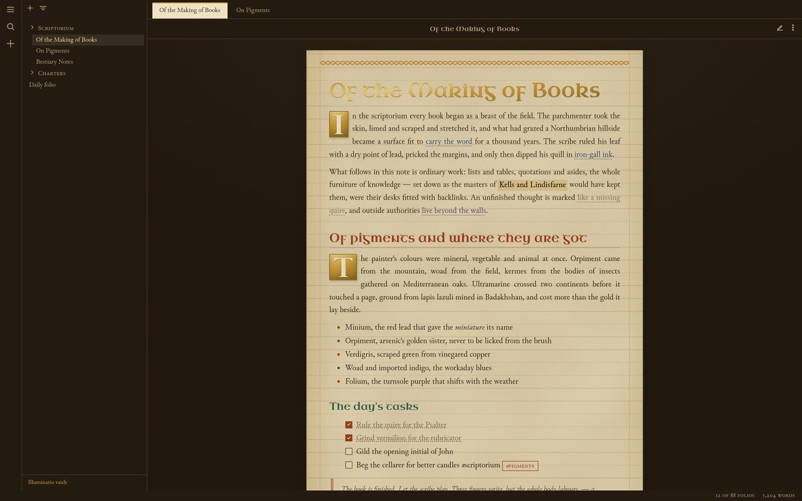
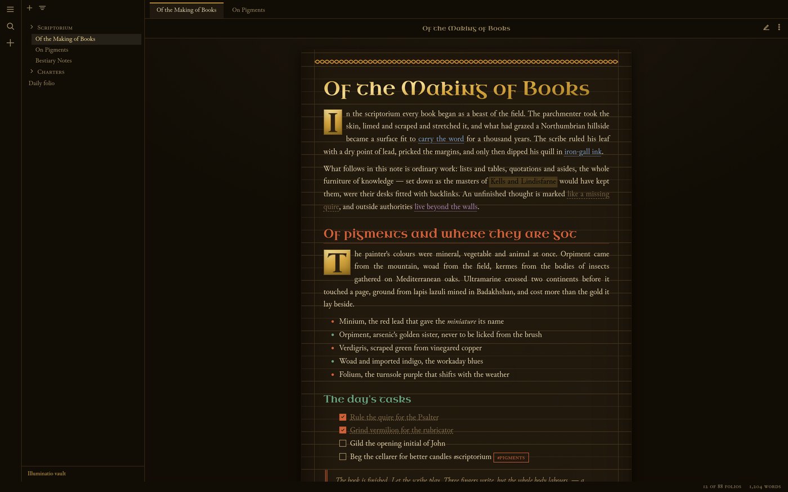
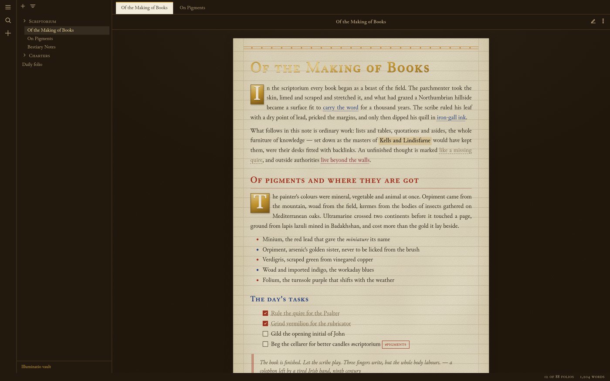
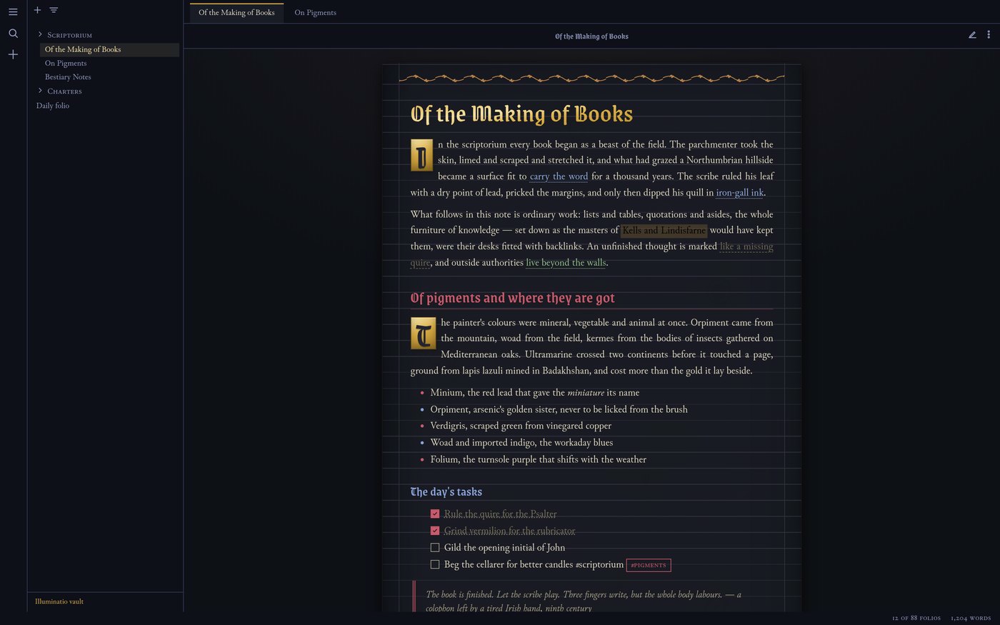
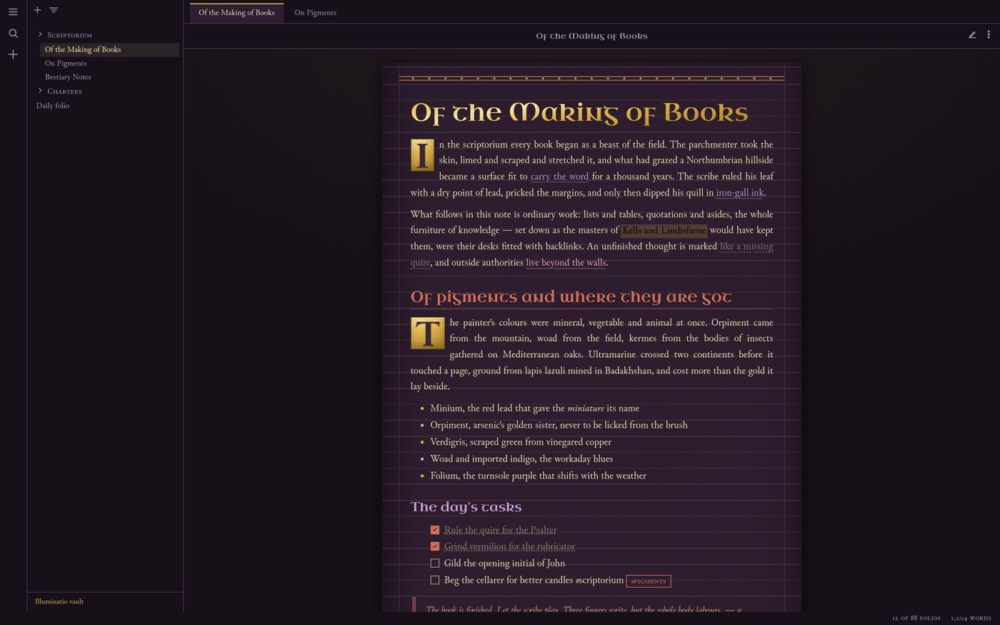
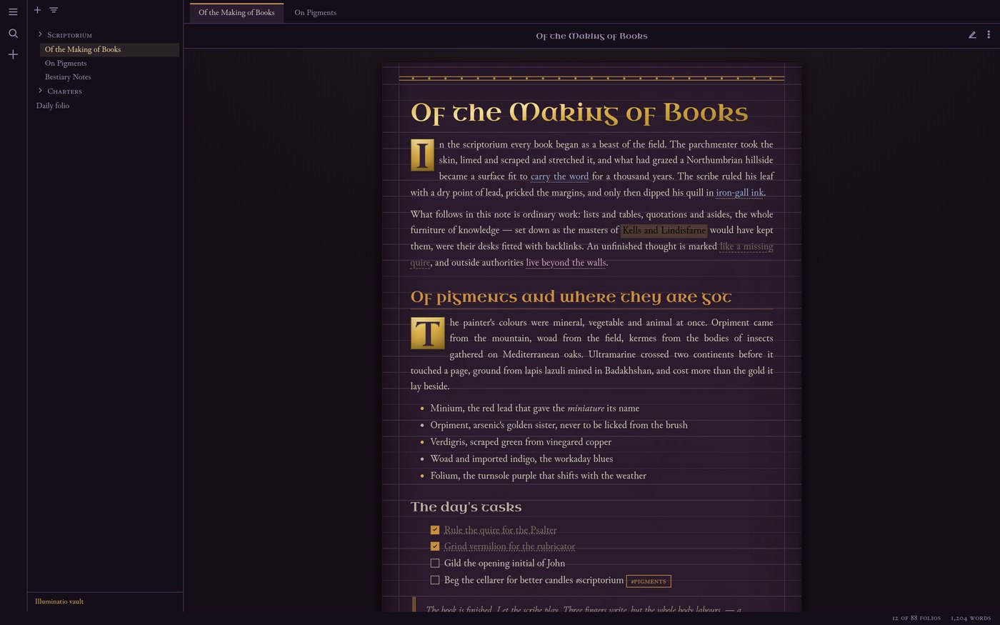

# Illuminatio

**An illuminated-manuscript theme for [Obsidian](https://obsidian.md).**

Illuminatio recreates the felt experience of reading an original medieval codex: a vellum leaf floating on a dark scriptorium desk, scored with plummet ruling, opened by gilded drop capitals, rubricated in red lead, and glossed in the margins. Eight famous manuscripts serve as selectable models, each with a daylight and a candlelit (dark mode) rendition.

The reading view is treated as **the finished folio** — justified, hyphenated, illuminated. The editing views stay a touch plainer, like the same leaf still on the writing desk.

## The eight manuscripts

Pick a model under **Settings → Style Settings → Illuminatio → The manuscript**. Every palette is drawn from the pigments actually found in that codex.

| Model | Date & school | What you get |
|---|---|---|
| **Book of Kells** *(default)* | c. 800, Insular | Warm vellum, iron-gall ink, red lead, verdigris and woad. Kells famously used **no gold leaf** — its shine came from orpiment, so the "gilding" here is orpiment-yellow. Uncial display script. |
| **Lindisfarne Gospels** | c. 715–720, Insular | Eadfrith's cooler, more delicate palette: indigo blues, mauve pinks, sage greens, gold used sparingly. |
| **Winchester Bible** | c. 1160–1175, Romanesque | Bright white calfskin, burnished gold leaf and lapis ultramarine. Display lettering in monumental small capitals. |
| **Très Riches Heures** | c. 1412–1416, International Gothic | The Limbourg brothers' saturated ultramarine, rose madder and gold, under textura display script. Dark mode is the deep blue of its night skies. |
| **Ellesmere Chaucer** | c. 1400–1405, English | The Canterbury Tales manuscript: warm English parchment, red and blue paraphs taking turns, gold bar-borders with ivy sprays, bookhand display script. |
| **Codex Aureus** | 8th–9th c., Carolingian | Chrysography — gold script on Tyrian-purple vellum, after the codices of St Emmeram and Stockholm. **Dark mode is the manuscript itself.** |
| **Codex Gigas** | c. 1220, Bohemia | The Devil's Bible: the largest medieval manuscript in the world, austere and fiercely rubricated. Best experienced in the dark. |
| **Codex Argenteus** | early 6th c., Ravenna | Wulfila's Gothic gospels: tarnished-silver script on imperial purple, gold for incipits. The canonical dark theme. |

## What makes it a manuscript

Every device below is a real scribal practice, mapped to a modern note-taking element:

- **The leaf on the desk** — notes render as a bordered parchment sheet with aged edges, a gutter shadow and vellum mottle, on a dark waxed-oak workspace.
- **Plummet ruling** — a faint uniform ruling grid scored across the whole leaf, the way pages were ruled before writing. Adjustable, down to invisible.
- **Drop capitals** — the first paragraph after the title and after major headings opens with a versal on a gilded panel (or a plain coloured versal, or none — your choice).
- **Gilding** — H1 and the inline title are laid in gold leaf (orpiment in Kells, true burnished gold in Winchester, silver-and-gold in Argenteus).
- **Rubrication** — H2 takes the rubricator's red; H3 answers in the manuscript's contrast pigment.
- **Versal alternation** — list markers take turns in red and blue/green, like paraph marks; ordered lists count in roman numerals.
- **Expunction** — completed tasks are deleted the way a scribe deleted: dots beneath the words, not a strike through them. (A strikethrough toggle exists for the unromantic.)
- **Marginal glosses** — blockquotes become smaller, tighter gloss script against a doubled rubric rule.
- **Manicules** — note-like callouts are marked with the pointing hand medieval readers drew in their margins; every callout family is tinted with a period pigment.
- **Canon-table framing** — tables get a double fillet frame, ruled columns and rubricated heads, in the manner of Eusebian canon tables.
- **Line fillers** — horizontal rules render as a pen flourish with a central lozenge.
- **Scribal typography** — [Junicode](https://github.com/psb1558/Junicode-font) (the medievalists' typeface) for text with oldstyle numerals; uncial, textura and bookhand display faces per manuscript; optional historic ligatures and pilcrow paragraph marks.
- **Underdotted links** — internal links read as glossed lemmata; unresolved links are dashed like a missing quire.

## Install

### From the community theme directory
Once accepted: **Settings → Appearance → Themes → Manage → search "Illuminatio"**.

### Manual
1. Download `manifest.json` and `theme.css` from the [latest release](../../releases) (or clone this repo).
2. Copy them into `YourVault/.obsidian/themes/Illuminatio/`.
3. **Settings → Appearance → Themes → Illuminatio**.

### Options
Install the [Style Settings](https://github.com/mgmeyers/obsidian-style-settings) plugin to unlock the manuscript selector and all options under **Settings → Style Settings → Illuminatio**:

- Manuscript model (the eight codices above)
- Text block width, ragged margin, scribal ligatures, pilcrows, system interface font
- Drop cap style, matte headings, flourishes & borders, list versals
- Parchment texture, ruling and edge-darkening intensity
- Flat page mode, parchment interface chrome
- Plain blockquotes/tables, strikethrough tasks
- Performance mode for older machines

The theme needs no plugins to look right — Style Settings only adds the choices.

## Screenshots

| | |
|---|---|
|  |  |
|  |  |
|  |  |

## Development

- Source partials live in `src/` (numbered load order). Build the root `theme.css` with:
  ```
  npm install
  npm run build
  ```
- Lint with the same config Obsidian uses for theme review:
  ```
  npm run lint
  ```
- `harness/harness.html` + `harness/obsidian-stub.css` preview the theme outside Obsidian (a minimal mock of Obsidian's DOM).
- The committed `screenshots/*.svg` are text-safe wrappers. To produce true raster PNGs (needed for the community-directory thumbnail), run `npm install puppeteer && npm run shots`.
- Ornament artwork (parchment grain, plait, ivy, fillet, manicule…) is generated as inline SVG data URIs — tiny, local, tintable via CSS `mask`.

### Fonts

Embedded as subsetted base64 WOFF2, all under the SIL Open Font License 1.1 (texts in `fonts/LICENSES/`):

| Face | Role | Author |
|---|---|---|
| [Junicode](https://github.com/psb1558/Junicode-font) | body text | Peter S. Baker |
| Uncial Antiqua | insular display | Astigmatic |
| Grenze Gotisch | textura display | Omnibus-Type |
| MedievalSharp | bookhand display | Wojciech Kalinowski |

## Historical honesty

The aim is *felt* accuracy, not cosplay: pigment palettes follow what conservators have identified in each codex (orpiment, minium, verdigris, woad, ultramarine, kermes, folium, iron-gall, silver and shell gold); the ruling, rubrication, versals, glosses, manicules and expunction all do the jobs their originals did. Where the digital medium forces an anachronism (code blocks, checkboxes), the theme sets it respectfully in period furniture rather than pretending it doesn't exist.

## License

CSS and theme code: MIT (see `LICENSE`). Embedded fonts: SIL OFL 1.1, © their respective authors.
